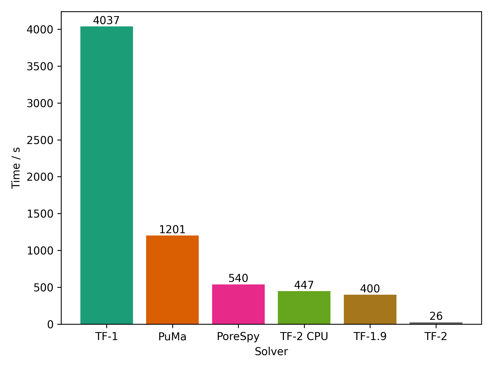

# Summary

TauFactor 2 is an open-source, GPU accelerated diffusion solver for the calculation of tortuosity factor. Tortuosity factor, $\tau$, is a material parameter that defines the reduction in diffusion transport arising from the curvature of flow paths through a pourous medium (see \autoref{example}). As shown in \autoref{eq:tort}, the effective diffusion co-efficient of a multiphase material, $D_{eff}$, can thus be calculated from the diffusive phases intrinsic diffusivity, $D$, and volume fraction, $\epsilon$ [@cooper2016taufactor]. Tortuosity factor has been a metric of interest in a broad range of fields for many of decades. In geophysics, $\tau$ influences groundwater flow through pourous rocks, which has significant environmental contamination impacts [@carey2016estimating]. Biomedical studies have used $\tau$ as a diagnostic indicator of disease through imaging of retinal blood vessels [@hart1999measurement]. Electrochemists use $\tau$ to solve a reduced-order system of equations describing the electrochemical behaviour of lithium-ion batteries, which influences a cells power rating [@landesfeind2018tortuosity]. The imaging and subsequent modeling of materials to determine $\tau$ is thus commonplace and crucial.

\begin{equation}\label{eq:tort}
D\_{eff} = D\dfrac{\epsilon}{\tau}
\end{equation}

![Microstructure and flux field of a sample from the microlib library [@kench2022microlib].\label{example}](example.pdf)

# Statement of need

Materials characterisation techniques are constantly improving, allowing the collection of larger field-of-view images with higher resolutions [@withers2021x]. Alongside these developments, machine learning algorithms have enabled the generation of arbitrarily large volumes, and can further enhance image quality through super-resolution techniques [@dahari2023fusion]. The resulting high fidelity microstructural datasets can be used to extract statistically representative metrics of a materials composition and performance. However, with increasing dataset size, the computational cost to perform such analysis can lead to prohibitively long run times. This is especially true for intrisically 3D parameters such as the tortuosity factor, as the number of voxels scales cubically with sample edge length. Computational efficiency is also crucial for high-throughput tasks, for example during material optimisation.

TauFactor 2 provides the necessary efficiency to ensure users can analyse large datasets in reasonable times. The software is built with PyTorch [@pytorch], a commonly used and highly optimised python package for machine learning. The GPU acceleration that has enabled the drastic speed up of neural network training proves equally effective for the task of iteratively solving diffusion equations, where matrix multiplication and addition are the main operations required. The use of Python and PyTorch ensures broad support and easy installation, as well as the option to run the software on CPU if GPU hardware is not available. The ability to run simulations with just a few lines of code ensures accessibility for researchers from the diverse fields where this software may be of merit.

The Python implementation is similar to the original TauFactor 1 MATLAB software [@cooper2016taufactor], taking advantage of efficiency gains such as the precalculation of prefactors and the use of over-relaxation. A significant difference is that in TauFactor 2, flux is calculated for all voxels. This replaces an indexing system in TauFactor 1, which solved only in diffusive voxels. We find that the speed of GPU indexing compared to matrix multiplication makes this trade-off worthwhile. Four different solvers are available: a standard diffusion solver for a single diffusive phase, a multi-phase solver for different diffusion co-efficients, a periodic solver, and an electrode tortuosity factor solver (see [@nguyen2020electrode]). There are also GPU accelerated functions for calculating volume fractions, surface areas and triple phase boundaries. To compare the performance of TauFactor 2 to other available software, a test volume with different tortuosity factors in each direction has first been defined. This microstructure is available in the GitHub repo, providing a standard against which new software can also be measured. The speed of five different solvers, namely TauFactor 1 [@cooper2016taufactor], TauFactor 1.9 (an updated MATLAB version TauFactor 1.9), TauFactor 2, TauFactor 2 CPU, PoreSpy [@gostick2019porespy] and Puma [@ferguson2018puma], are shown in \autoref{speeds}. To check the accuracy of the calaculated tortuosity factors, we overconverge TauFactor 1 to give a ‘true value’ in each direction. Using default convergence criteria, all five solvers are within 0.5% of the true values other then PuMa’s explicit jump solver (5% error), which is thus excluded. For this analysis we used a NVIDIA A6000 48GB GPU and AMD Ryzen Threadripper 3970X Gen3 32 Core TRX4 CPU. TauFactor 2 is over 10 times faster than the next best solver, TauFactor 1.9.

# Acknowledgements

We acknowledge contributions from Amir Dahari.

# References
